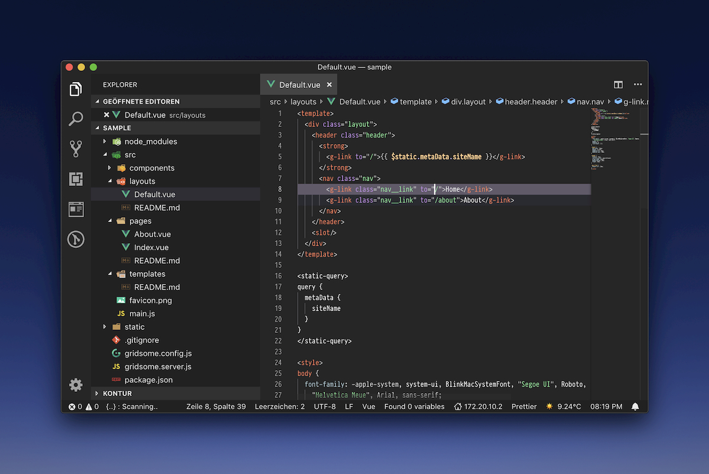
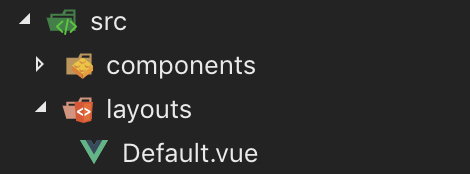

# Editor Setup

[Visual Studio Code](https://code.visualstudio.com/) ist seit Langem mein Werkzeug der Wahl, um Anwendungen zu programmieren. Überzeugt hat es mich durch Schnelligkeit und Anpassungsfähigkeit.

## Oberfläche



### Schriftart

- [Pra&shy;gmataPro](https://www.fsd.it/shop/fonts/pragmatapro/)

  PragmataPro unterstützt eine Vielzahl an Ligaturen. Beispielsweise:

  

### Farbschema

- [IBM Color Scheme](https://marketplace.visualstudio.com/items?itemName=paperfanz.ibm-color-palette-color-scheme)

### Icons

- [VSCode-Icons](https://marketplace.visualstudio.com/items?itemName=robertohuertasm.vscode-icons)

  

## Nützliche Erweiterungen

- [TabNine](https://tabnine.com/)

  Durch Machine Learning gestütztes Autocomplete für jede Sprache. Die Ergebnisse können durch das zuschalten der jeweiligen Language Server verbessert werden. Hierfür muss `TabNine::sem` getippt werden.

- [GitLens](https://marketplace.visualstudio.com/items?itemName=eamodio.gitlens)
- [Import Cost](https://marketplace.visualstudio.com/items?itemName=wix.vscode-import-cost)
- [NPM Intellisense](https://marketplace.visualstudio.com/items?itemName=christian-kohler.npm-intellisense)

## Syntax

- [ES6-String-HTML](https://marketplace.visualstudio.com/items?itemName=tobermory.es6-string-html) färbt den Inhalt von Template Strings vor welchen `/*html*/` oder `html` steht wie normales HTML ein.

- [TODO Highlight](https://marketplace.visualstudio.com/items?itemName=wayou.vscode-todo-highlight) hebt `TODO` in Kommentaren deutlich hervor.

- [Indented Block Highlighting](https://marketplace.visualstudio.com/items?itemName=byi8220.indented-block-highlighting)

## Formatierung

- [EditorConfig](https://marketplace.visualstudio.com/items?itemName=editorconfig.editorconfig) ermöglicht das festlegen von verschiedenen Editor Einstellungen pro Projekt. Beispielsweise ob Tabs oder Leerzeichen für ein Tab genutzt werden oder wie viele Leerzeichen ein Tab groß ist.
- [ESLint](https://marketplace.visualstudio.com/items?itemName=dbaeumer.vscode-eslint) überprüft ob JavaScript nach vorher definierten Regeln geschrieben wurde und bietet im Zusammenspiel mit Prettier eine Autokorrektur an.
- [Prettier](https://marketplace.visualstudio.com/items?itemName=esbenp.prettier-vscode) ermöglicht die automatische Formatierung von nahezu allen Dateitypen.

Um das Zusammenspiel der verschiedenen Formatierungshilfen zu ermöglichen, wird folgende Konfiguration genutzt:

```json
  "css.validate": false,
  "less.validate": false,
  "scss.validate": false,
  "eslint.autoFixOnSave": false,
  "editor.formatOnPaste": false,
  "editor.formatOnSave": true,
  "prettier.stylelintIntegration": true,
  "prettier.eslintIntegration": true,
```

## Anderes

- [Clock In Statusbar](https://marketplace.visualstudio.com/items?itemName=compulim.vscode-clock)
- [Instant Weather](https://marketplace.visualstudio.com/items?itemName=sneezry.vscode-instant-weather)
- [IP Address](https://marketplace.visualstudio.com/items?itemName=compulim.vscode-ipaddress)
- [VSCode-Spotify](https://marketplace.visualstudio.com/items?itemName=shyykoserhiy.vscode-spotify)
